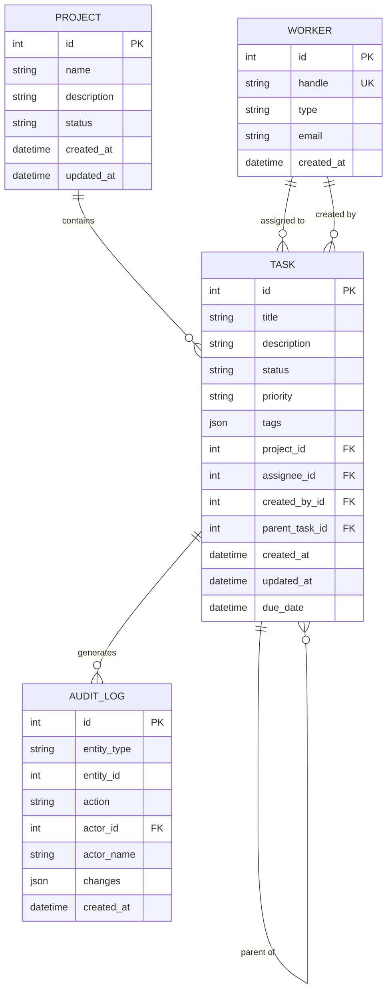

# Database Design and Normalization

Before you write a single line of SQLModel code, you need to think like a data architect. What are your entities? How do they relate? What data belongs where?

Poor design creates problems no amount of clever code can fix. Good design makes everything else easier.

## The Data Architect's Questions

When designing a database, ask these questions in order:

### 1. What Are Your Entities?

Entities are the "things" your system tracks. For our Task Manager:

| Question | Answer | Entity |
|----------|--------|--------|
| What do users create? | Tasks | `Task` |
| What groups tasks? | Projects | `Project` |
| Who does the work? | Workers (humans + agents) | `Worker` |
| What records happened? | Audit events | `AuditLog` |

**Exercise:** List entities before designing tables. If you can't name it clearly, it might not be an entity.

### 2. What Attributes Belong to Each Entity?

Attributes describe entities. For a Task:

```
Task
├── id (identifier)
├── title (what it is)
├── description (details)
├── status (current state)
├── priority (importance)
├── created_at (when created)
├── updated_at (last change)
└── due_date (deadline)
```

**The key question:** Does this attribute describe THIS entity, or something else?

- `task.title` → Describes the task ✓
- `task.project_name` → Describes the project ✗ (should be in Project)
- `task.assignee_email` → Describes the worker ✗ (should be in Worker)

### 3. How Do Entities Relate?

Relationships connect entities:

```
Project ──1:N──► Task      (one project has many tasks)
Worker ──1:N──► Task      (one worker assigned to many tasks)
Task ──1:N──► Task        (one task has many subtasks - self-referential)
Task ──1:N──► AuditLog    (one task has many audit events)
```

**Relationship types:**

| Type | Example | Implementation |
|------|---------|----------------|
| One-to-Many (1:N) | Project → Tasks | FK in Task |
| Many-to-One (N:1) | Tasks → Project | FK in Task |
| One-to-One (1:1) | User → Profile | FK with unique |
| Many-to-Many (M:N) | Tasks ↔ Tags | Link table |

## Normal Forms: Why They Matter

Normalization eliminates data anomalies—bugs that occur when the same fact is stored in multiple places.

### The Problem: Denormalized Data

Imagine storing task data like this:

```
| task_id | title      | project_name | project_desc    | assignee | assignee_email    |
|---------|------------|--------------|-----------------|----------|-------------------|
| 1       | Fix auth   | Backend API  | API services    | @john    | john@example.com  |
| 2       | Add tests  | Backend API  | API services    | @jane    | jane@example.com  |
| 3       | UI polish  | Frontend     | User interface  | @john    | john@example.com  |
```

**What could go wrong?**

1. **Update anomaly:** Change project description → must update ALL rows
2. **Insert anomaly:** Can't add a project without a task
3. **Delete anomaly:** Delete last task → lose project information

### First Normal Form (1NF)

**Rule:** Every column contains atomic (indivisible) values. No repeating groups.

**Violation:**
```
| task_id | title    | tags                        |
|---------|----------|------------------------------|
| 1       | Fix auth | security, urgent, backend   |
```

**Fixed (1NF):**
```
| task_id | title    | tag      |
|---------|----------|----------|
| 1       | Fix auth | security |
| 1       | Fix auth | urgent   |
| 1       | Fix auth | backend  |
```

**Or use a separate Tags table (better):**
```
Tasks:  | task_id | title    |
Tags:   | tag_id  | name     |
TaskTags: | task_id | tag_id |
```

**Agent design note:** JSONB columns (`tags: list[str]`) technically violate 1NF but are acceptable when:
- You query by tag existence, not individual tag properties
- Tags have no attributes beyond their value
- Performance matters more than strict normalization

### Second Normal Form (2NF)

**Rule:** Every non-key column depends on the ENTIRE primary key.

Only applies to composite keys. If your primary key is a single column (`id`), you're automatically in 2NF.

**Violation (composite key):**
```
| project_id | task_seq | title    | project_name |
|------------|----------|----------|--------------|
| 1          | 1        | Fix auth | Backend API  |
| 1          | 2        | Add tests| Backend API  |
```

Here, `project_name` depends only on `project_id`, not on the full key (`project_id`, `task_seq`).

**Fixed (2NF):**
```
Projects: | project_id | project_name |
Tasks:    | project_id | task_seq | title |
```

### Third Normal Form (3NF)

**Rule:** No non-key column depends on another non-key column.

**Violation:**
```
| task_id | title    | assignee_id | assignee_email    |
|---------|----------|-------------|-------------------|
| 1       | Fix auth | 1           | john@example.com  |
```

Here, `assignee_email` depends on `assignee_id`, not directly on `task_id`.

**Fixed (3NF):**
```
Tasks:   | task_id | title    | assignee_id |
Workers: | id      | email    |
```

### The 3NF Test

For each column, ask: "Does this value change when something OTHER than the primary key changes?"

If yes → move it to another table.

## When to Break the Rules

Normalization optimizes for data integrity. But agents often optimize for read performance.

### Acceptable Denormalization

**1. Audit Logs (snapshot data):**
```python
class AuditLog(SQLModel, table=True):
    id: int | None = Field(default=None, primary_key=True)
    entity_type: str
    entity_id: int
    action: str
    # Denormalized - captures state AT TIME OF ACTION
    actor_name: str  # Not just actor_id
    entity_title: str  # Snapshot of title when action occurred
    created_at: datetime
```

**Why:** Audit logs record history. If you normalize and the worker's name changes, your audit log shows the NEW name for OLD actions—wrong!

**2. Read-heavy aggregates:**
```python
class Project(SQLModel, table=True):
    id: int | None = Field(default=None, primary_key=True)
    name: str
    # Denormalized counters - updated on task changes
    task_count: int = Field(default=0)
    completed_count: int = Field(default=0)
```

**Why:** Counting tasks requires scanning the Tasks table. For dashboards showing 100 projects, that's 100 COUNT queries. Denormalized counters = 1 query.

**3. JSONB for flexible metadata:**
```python
class Task(SQLModel, table=True):
    id: int | None = Field(default=None, primary_key=True)
    title: str
    # Denormalized - flexible key-value data
    metadata: dict = Field(
        default_factory=dict,
        sa_column=Column(JSONB),
    )
```

**Why:** Creating tables for every possible metadata field is impractical. JSONB provides flexibility with query support.

### When NOT to Denormalize

| Keep Normalized When... | Why |
|------------------------|-----|
| Data changes frequently | Updates become expensive |
| Consistency is critical | Anomalies cause bugs |
| Storage matters | Duplication costs space |
| Relationships need traversal | JOINs work fine |

## Designing the Task Manager Schema

Let's apply these principles to our Task Manager:

### Entity Analysis

```
Entities:
├── Project (groups of related tasks)
├── Worker (humans and AI agents doing work)
├── Task (units of work)
└── AuditLog (change history)
```

### Relationship Mapping

```
Project ◄──────────── Task (project_id FK)
                        │
Worker ◄───────────────┤ (assignee_id FK, nullable)
                        │
Worker ◄───────────────┤ (created_by_id FK, required)
                        │
Task ◄─────────────────┘ (parent_task_id FK, self-referential)
```

## Entity-Relationship Diagrams (ERD)

Text descriptions work, but diagrams communicate faster. ERDs show entities, attributes, and relationships visually.

### Mermaid ERD Syntax

Docusaurus renders Mermaid diagrams natively. Here's our Task Manager schema:



### Reading ERD Notation

| Symbol | Meaning |
|--------|---------|
| `\|\|` | Exactly one (mandatory) |
| `o\|` | Zero or one (optional) |
| `\|{` | One or more |
| `o{` | Zero or more |
| `PK` | Primary Key |
| `FK` | Foreign Key |
| `UK` | Unique Key |

**Reading the diagram:**
- `PROJECT ||--o{ TASK` → One project contains zero or more tasks
- `WORKER ||--o{ TASK` → One worker is assigned to zero or more tasks
- `TASK ||--o{ TASK` → One task can be parent of zero or more subtasks

### Cardinality Cheat Sheet

| Relationship | Left Side | Right Side | Example |
|--------------|-----------|------------|---------|
| One-to-Many | `\|\|` (one) | `o{` (many) | Project → Tasks |
| Many-to-One | `}o` (many) | `\|\|` (one) | Tasks → Project |
| One-to-One | `\|\|` | `\|\|` | User → Profile |
| Many-to-Many | `}o` | `o{` | Tasks ↔ Tags (via link table) |

### When to Draw ERDs

| Situation | Draw ERD? |
|-----------|-----------|
| New project/feature | Yes - communicate design |
| Code review with schema changes | Yes - visualize impact |
| Debugging relationship issues | Yes - find the problem |
| Solo prototype | Optional - but helps thinking |

### Normalized Schema

```
projects
├── id (PK)
├── name
├── description
├── status
├── created_at
└── updated_at

workers
├── id (PK)
├── handle (unique, e.g., @john)
├── type (human/agent)
├── email (nullable, for humans)
└── created_at

tasks
├── id (PK)
├── title
├── description
├── status
├── priority
├── project_id (FK → projects.id)
├── assignee_id (FK → workers.id, nullable)
├── created_by_id (FK → workers.id)
├── parent_task_id (FK → tasks.id, nullable)
├── tags (JSONB - acceptable denormalization)
├── created_at
├── updated_at
└── due_date

audit_logs
├── id (PK)
├── entity_type
├── entity_id
├── action
├── actor_id (FK → workers.id)
├── actor_name (denormalized snapshot)
├── changes (JSONB - what changed)
└── created_at
```

### Design Decisions Explained

| Decision | Rationale |
|----------|-----------|
| `tags` as JSONB | Tags are simple strings, queried by existence, no tag metadata |
| `actor_name` in audit | Historical accuracy—name at time of action |
| Separate `assignee_id` and `created_by_id` | Different relationships to Worker, both needed |
| `parent_task_id` self-reference | Enables task hierarchy without separate table |

## Try With AI

### Prompt 1: Entity Extraction

```
I'm building a system where:
- Users create documents
- Documents belong to folders
- Users can share documents with other users
- Documents have versions (history of changes)
- Users can comment on specific parts of documents

Identify the entities, their key attributes, and relationships.
Show me the normalized schema design.
```

**What you're learning:** Entity identification—extracting structure from requirements.

### Prompt 2: Normalization Practice

```
This table violates normal forms:

| order_id | customer_name | customer_email | products           | total |
|----------|---------------|----------------|--------------------| ------|
| 1        | John Smith    | john@email.com | Widget, Gadget     | 150   |
| 2        | John Smith    | john@email.com | Gadget             | 75    |

Identify which normal forms are violated and why.
Show me the normalized schema (to 3NF).
```

**What you're learning:** Anomaly detection—recognizing normalization violations.

### Prompt 3: Denormalization Decision

```
My agent reads task summaries 1000x more often than tasks are updated.
Each summary needs: task title, project name, assignee handle.

Currently this requires 3 JOINs. Should I denormalize?
If yes, show me how. If no, explain why not.
What's the maintenance cost of denormalization here?
```

**What you're learning:** Trade-off analysis—when breaking rules makes sense.

### Safety Note

Schema design decisions are hard to reverse. A wrong foreign key relationship might require migrating millions of rows. Design carefully, prototype with realistic data volumes, and get schema reviews before production deployment.

---

## Reflect on Your Skill

You built a `relational-db-agent` skill in Lesson 0. Test its design knowledge.

### Test Your Skill

```
Using my relational-db-agent skill, I need to design a schema for
a notification system where:
- Users receive notifications
- Notifications can be about different entity types (task, project, comment)
- Notifications have read/unread status
- Users can configure notification preferences

Give me the normalized schema with entity relationships explained.
```

### Identify Gaps

Ask yourself:
- Did my skill identify all entities (User, Notification, NotificationPreference)?
- Did it explain the relationships clearly?
- Did it consider polymorphic references (entity_type + entity_id)?
- Did it mention any acceptable denormalization?

### Improve Your Skill

If you found gaps:

```
My relational-db-agent skill doesn't explain design decisions.
Add this to its knowledge:

When designing schemas, always:
1. List entities before tables
2. Map relationships with cardinality (1:N, M:N)
3. Check each column against 3NF
4. Document any intentional denormalization with rationale
```

Your skill now thinks like a data architect.
